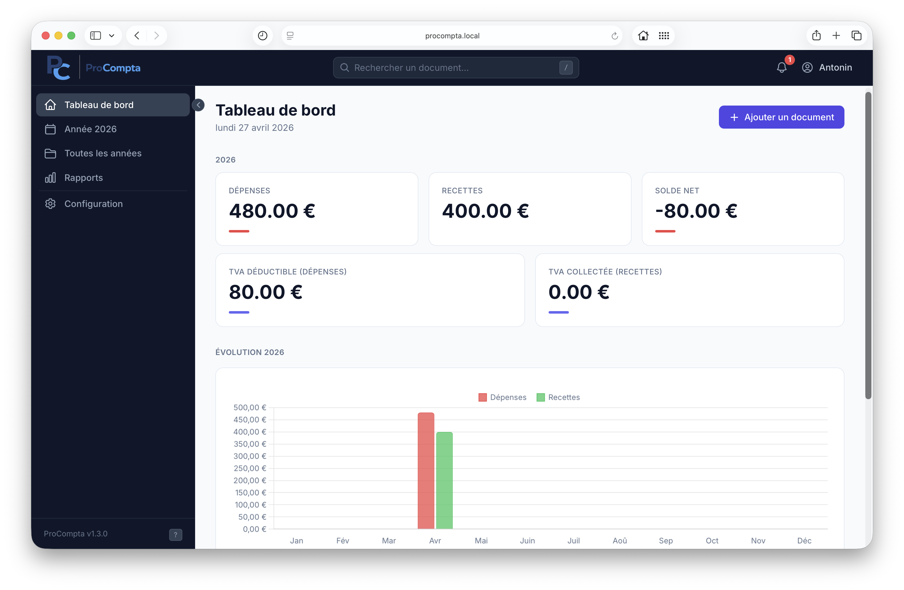
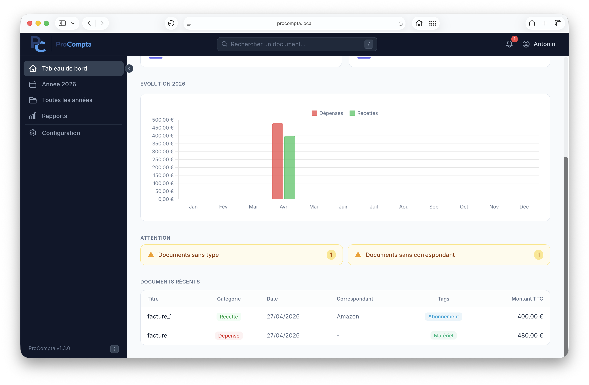
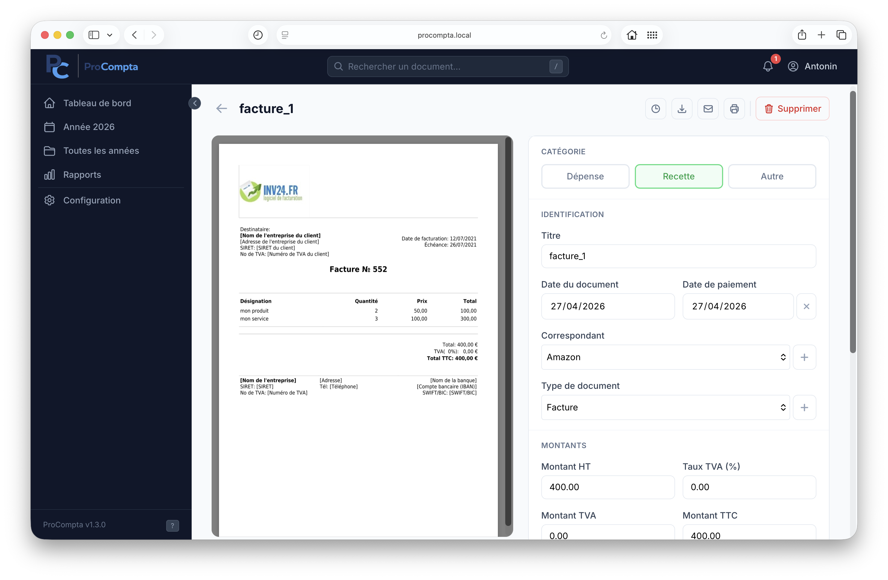
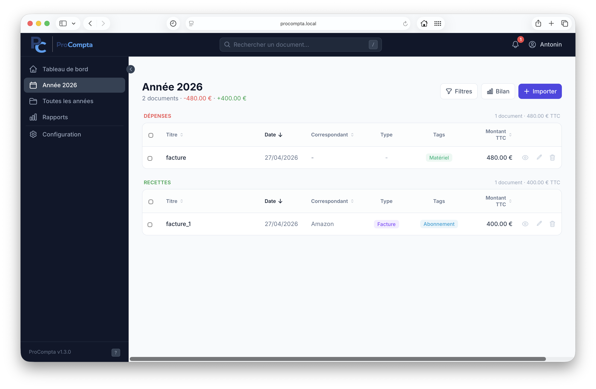
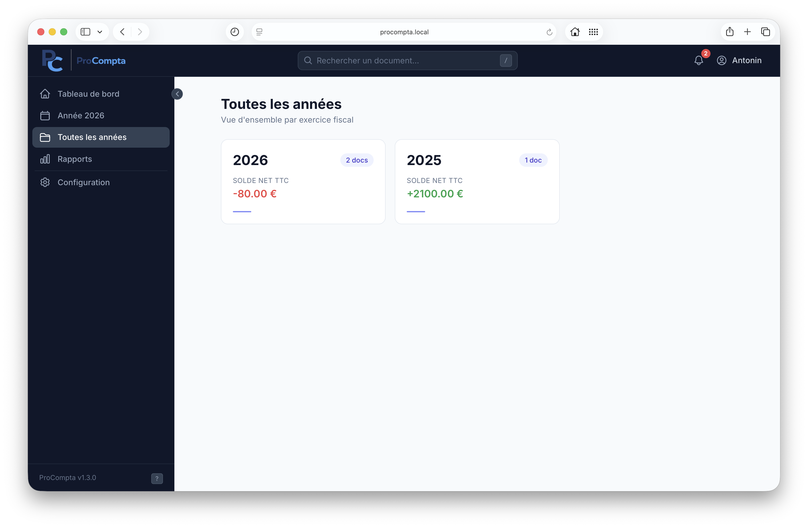
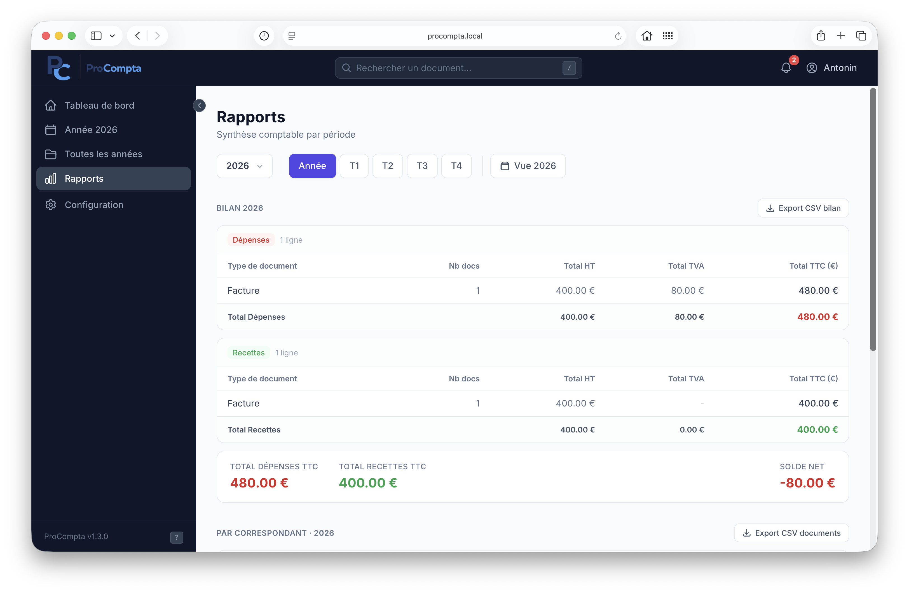
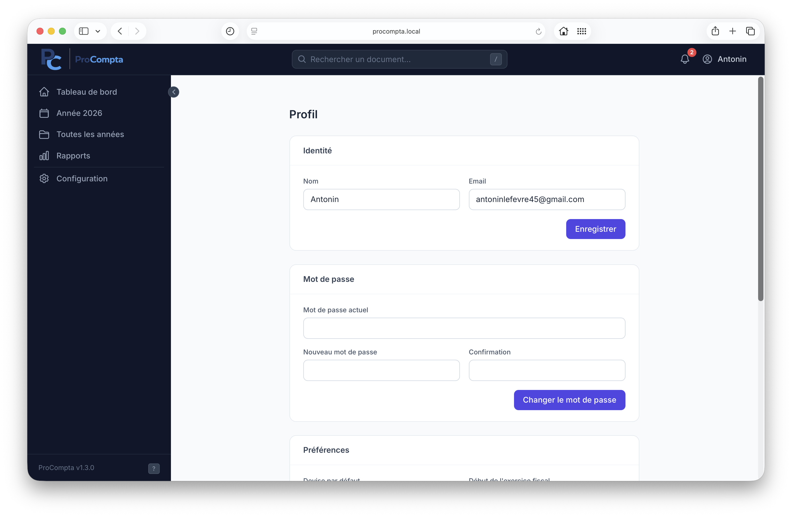

<p align="center">
  
</p>

<h4 align="center">Gestionnaire de documents comptables · local · sans abonnement · sans cloud.</h4>

<p align="center">
  
  
  
  
</p>

<p align="center">
  <a href="#-à-quoi-ça-sert">À quoi ça sert</a> •
  <a href="#-installation">Installation</a> •
  <a href="#-utilisation-au-quotidien">Utilisation</a> •
  <a href="#️-raccourcis-clavier">Raccourcis</a> •
  <a href="#-fonctionnalités">Fonctionnalités</a> •
  <a href="#️-stack">Stack</a>
</p>

## Aperçu

<p align="center">
  
  
</p>

---

## À quoi ça sert

ProCompta est un logiciel **auto-hébergé** pour gérer vos documents comptables (factures, relevés, contrats, bulletins de salaire…). Tout tourne en local sur votre machine via Docker - vos fichiers ne quittent jamais votre ordinateur.

Il s'adresse aux **indépendants, micro-entrepreneurs et petites structures** qui veulent un outil simple pour :

- centraliser leurs documents sans dépendre d'un service cloud
- suivre leurs dépenses et recettes par année
- garder une trace de leurs correspondants (fournisseurs, clients, banques)
- générer des bilans et rapports de TVA sans logiciel de comptabilité lourd

---

## 🚀 Installation

**Prérequis : Docker Desktop installé et démarré.**

```bash
git clone https://github.com/antonin-lfv/ProCompta.git
cd ProCompta
chmod +x setup.sh
./setup.sh
```

Le script fait tout automatiquement :

1. Vérifie que Docker est disponible
2. Demande votre prénom, e-mail et mot de passe
3. Génère une `SECRET_KEY` et un mot de passe PostgreSQL aléatoires
4. Crée les dossiers `storage/` (documents) et `backups/`
5. Propose de configurer le domaine local `http://procompta.local` (optionnel - nécessite sudo)
6. Construit les images Docker et applique les migrations de base de données

À la fin, l'URL et vos identifiants s'affichent dans le terminal.

> **Mise à jour** : `git pull && docker compose up --build -d`

---

## 📋 Utilisation au quotidien

<br>

<p align="left">
  

  <strong>📄 Ajouter et éditer un document</strong>
  <br><br>

  Cliquez sur <strong>Nouveau</strong> (ou appuyez sur <code>N</code>), puis glissez-déposez un fichier PDF, JPEG ou PNG. ProCompta détecte automatiquement la date, le correspondant et le type de document. Pour les images, une analyse OCR est effectuée automatiquement.

  <br><br>

  Complétez ensuite les informations manuellement : montant HT/TVA/TTC, devise, catégorie (dépense / recette / autre), tags. Utilisez l'import par lot pour uploader plusieurs fichiers en une seule fois - les doublons sont détectés automatiquement par hash SHA-256.

  <br clear="all"/>
</p>

<br>

<p align="left">
  

  <strong>📅 Vue par année</strong>
  <br><br>

  Consultez tous les documents d'une année dans un tableau filtrable et triable. Filtres disponibles par correspondant, type de document, catégorie, tags, montant et date. Chaque ligne donne accès à la prévisualisation intégrée du fichier.

  <br><br>

  Sélectionnez plusieurs documents via les cases à cocher pour les <strong>archiver</strong>, <strong>désarchiver</strong> ou <strong>supprimer</strong> en une seule action groupée.

  <br clear="all"/>
</p>

<br>

<p align="left">
  

  <strong>🗂️ Vue globale - toutes les années</strong>
  <br><br>

  Accédez à la liste complète des années enregistrées avec leurs statistiques : nombre de documents, total dépenses et recettes. Un point d'entrée rapide pour naviguer vers une année spécifique ou avoir une vision d'ensemble de votre activité.

  <br clear="all"/>
</p>

<br>

<p align="left">
  

  <strong>📊 Rapports & finances</strong>
  <br><br>

  La page Rapports affiche pour l'année sélectionnée : bilan mensuel dépenses/recettes, répartition par type de document et <strong>TVA trimestrielle</strong> (base HT, TVA déductible, TVA collectée, solde net par trimestre).

  <br><br>

  Les devises étrangères sont converties en € via les taux BCE à la date du document. Export CSV disponible pour le bilan comptable, la TVA trimestrielle et la liste des documents.

  <br clear="all"/>
</p>

<br>

<p align="left">
  

  <strong>👤 Profil & Backup</strong>
  <br><br>

  La page Profil centralise vos informations personnelles et la gestion des sauvegardes. <strong>Téléchargez</strong> un ZIP contenant le dump SQL et tous vos fichiers, ou <strong>restaurez</strong> une sauvegarde existante (confirmation par mot de passe requise).

  <br clear="all"/>
</p>

---

## ⌨️ Raccourcis clavier

| Touche | Action |
|--------|--------|
| `/` | Focus la barre de recherche |
| `N` | Nouveau document |
| `?` | Afficher l'aide des raccourcis |
| `Esc` | Fermer les modales |

---

## ✨ Fonctionnalités

| Catégorie | Détail |
|-----------|--------|
| **Import** | PDF / JPEG / PNG, import unitaire ou par lot, détection de doublons (hash SHA-256) |
| **Auto-détection** | Date PDF, correspondant et type extraits du contenu (OCR pour les images) |
| **Organisation** | Correspondants, types de document (12 par défaut), tags colorés (5 par défaut), catégories |
| **Finances** | Montants HT / TVA / TTC, 6 devises, conversion BCE automatique à la date du document |
| **Vues** | Tableau de bord, vue par année, tous les documents, rapports trimestriels TVA |
| **Recherche** | Recherche par titre, filtres multiples (date, montant, correspondant, type, tags), tri des colonnes |
| **Actions groupées** | Sélection multiple, archivage / désarchivage / suppression en lot |
| **Exports** | CSV bilan comptable, CSV TVA trimestrielle, CSV liste des documents |
| **Workflow** | Archivage, journal d'activité par document, notifications documents incomplets |
| **Sécurité** | Authentification e-mail + mot de passe, session 30 jours (HMAC signé) |
| **Backup** | Export ZIP (dump SQL + fichiers), restauration avec confirmation par mot de passe |
| **Ergonomie** | Raccourcis clavier, tooltips, preview intégrée, responsive |

---

## 🛠️ Stack

| Couche | Technologie |
|--------|-------------|
| Backend | Python 3.13, FastAPI, SQLAlchemy async |
| Base de données | PostgreSQL 16 |
| Migrations | Alembic |
| Frontend | Jinja2, Tailwind CSS 3 (build CLI), Alpine.js |
| Previews & OCR | pdf2image + Poppler, Pillow, Tesseract (fra + eng) |
| Packaging | uv |
| Reverse proxy | Caddy |
| Infrastructure | Docker Compose |
